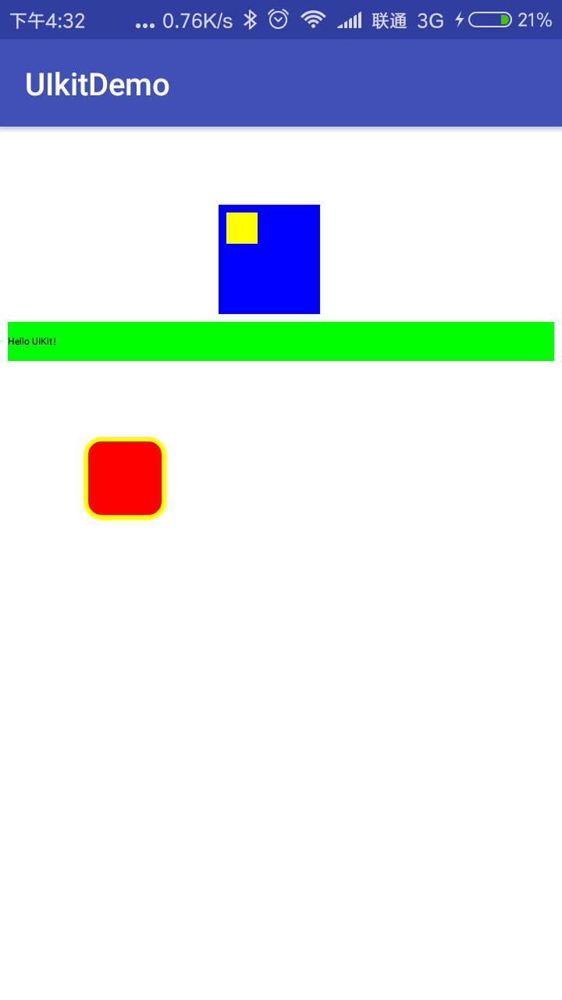

# Kotlin-UIKit
使用iOS的编程思路来写安卓的代码

这个库在Activity和View的基础上，按照iOS的逻辑封装的一套库，目的是希望能够用写iOS代码的方式来写安卓的代码。

下面是一段代码及对应的显示效果

		//蓝色视图，上面放置一个黄色的视图
  		blueview = UIView()
        blueview!!.frame = CGRect(x = 100f, y = 100f, width = 130f, height = 140f)
        this.view!!.addSubview(blueview!!)
        blueview!!.backgroundColor = Color.BLUE

        yellowview = UIView()
        yellowview.frame = CGRect(10f,10f,40f,40f)
        yellowview.backgroundColor = Color.YELLOW
        blueview!!.addSubview(yellowview)

		 //带有点击事件的视图，点击后由ViewController控制其他视图动作
        touchView = DemoView()
        touchView.frame = CGRect(110f,400f,100f,100f)
        touchView.backgroundColor = Color.RED
        touchView.layer.borderColor = Color.YELLOW
        touchView.layer.cornerRadius = 20f
        touchView.layer.borderWidth = 6f
        this.view!!.addSubview(touchView)

        touchView.touchblock = {

            moveBlueView()
        }

		 //文本
        var label = UILabel()
        label.frame = CGRect(10f,250f,700f,50f)
        label.backgroundColor = Color.GREEN
        label.text = "Hello UIKit！"
        view!!.addSubview(label)

